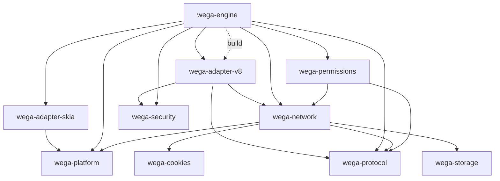

# Dependency graph after worker runtime isolation

```mermaid
graph TD
  wega_adapter_skia["wega-adapter-skia"]
  wega_adapter_v8["wega-adapter-v8"]
  wega_cookies["wega-cookies"]
  wega_engine["wega-engine"]
  wega_network["wega-network"]
  wega_permissions["wega-permissions"]
  wega_platform["wega-platform"]
  wega_protocol["wega-protocol"]
  wega_security["wega-security"]
  wega_storage["wega-storage"]
  wega_adapter_skia --> wega_platform
  wega_adapter_v8 --> wega_network
  wega_adapter_v8 --> wega_protocol
  wega_adapter_v8 --> wega_security
  wega_engine --> wega_adapter_skia
  wega_engine --> wega_adapter_v8
  wega_engine -.->|build| wega_adapter_v8
  wega_engine --> wega_network
  wega_engine --> wega_permissions
  wega_engine --> wega_platform
  wega_engine --> wega_protocol
  wega_engine --> wega_security
  wega_network --> wega_cookies
  wega_network --> wega_platform
  wega_network --> wega_protocol
  wega_network --> wega_storage
  wega_permissions --> wega_network
  wega_permissions --> wega_protocol
```
